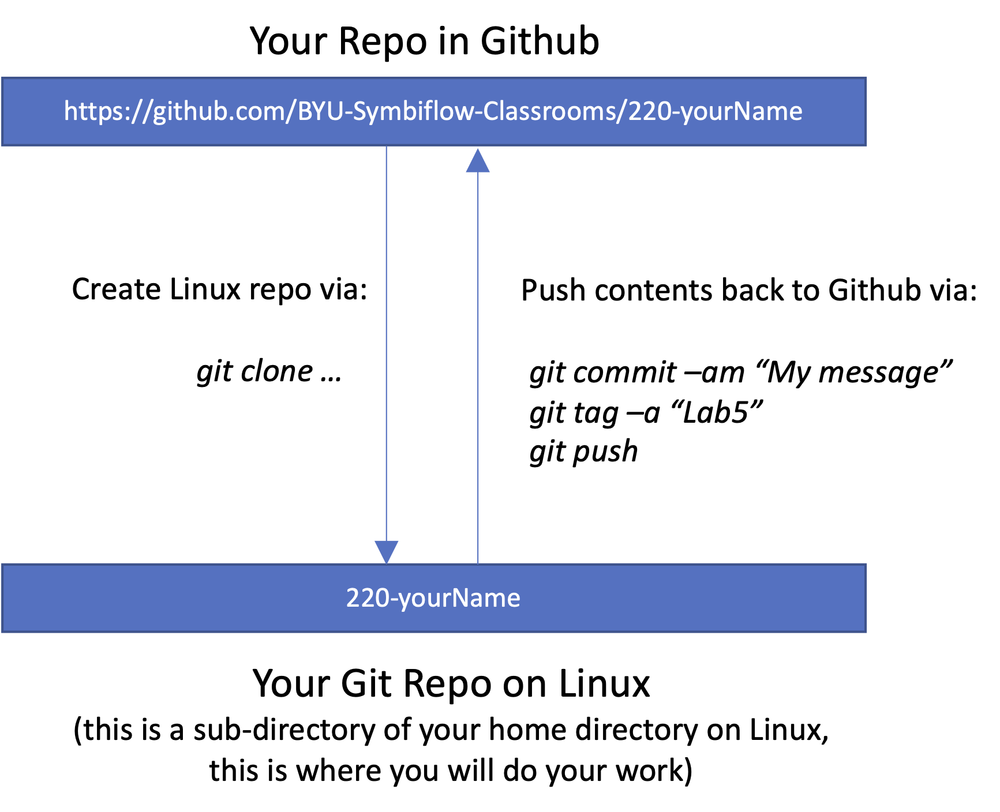
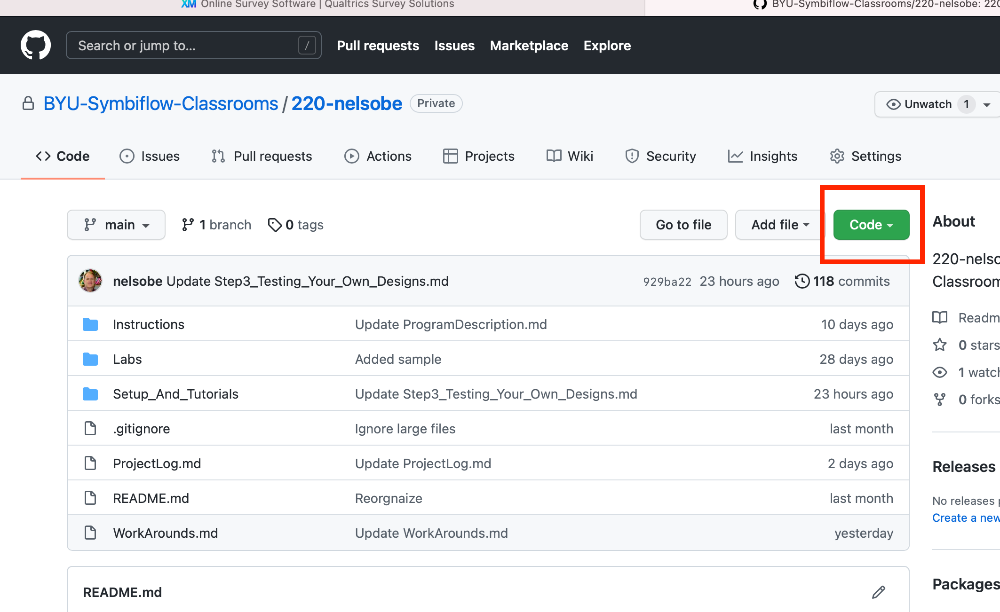
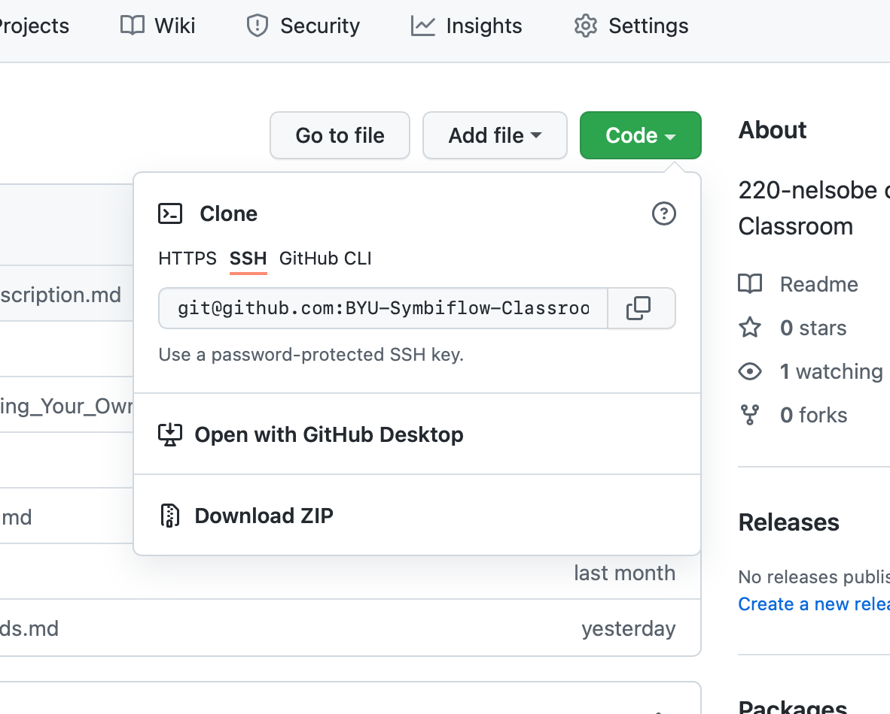
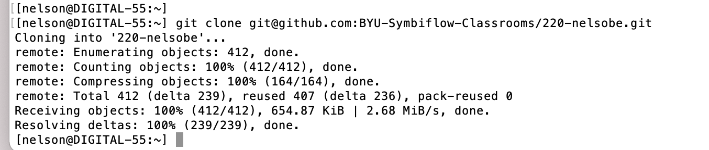

# Step 1

# 1. Preparation to Start Setting Up
Before getting started, please do the following:

 - You should print this page of instructions or bookmark it so you have a reference to it as you work through the setup process.

# 2. Overview
This semester as you test your designs using the F4PGA tools you are going to be doing that in a `git` repository on your Linux machine.  Thus, you will be learning about git during the semester.  However, that local repository will be tied to one at https://github.com.   This is shown in this figure:

The top box is the Github Repository you will create in the first couple of steps below.  After that, you will *clone* it onto a BYU Linux machine.  You will then do all your work on the Linux machine inside the directory that holds your repository files.  Once you have a lab completed you will `git commit` and then `git push` you results back up to Github where the F4PGA TAs can get access to your results.

1. The instructions for setting up your repositories make up the rest of this document.   Doing this will take about 15 minutes.   This is the first step you will need to complete.

2. Once you have set up your repository correctly, you can test your first design using F4PGA. The way you will do this is you will copy your design files from your passed-off lab (meaning it all worked in Vivado) into a directory in your local repository in Linux.  You will then re-compile and test it using the F4PGA tools in that repository.  Document your results and any errors you might have come across using the [`readme.py`](https://github.com/byuccl/f4pga-class-testing/blob/dev/Setup_And_Tutorials/bin/README.md) script and then push your results back up to your Github repository.

All along the way the F4PGA TAs will be helping you.  They will be able to help you set everything up, test it to make sure it is working, and then help you as needed as you test your designs using the F4PGA tools.  So, don't be nervous - there are many people ready and available when you have questions.

## 2.1 A Note About Your Repository Name
To keep things simple this document will be using the name `220-myusername` for the name of your repository. As you follow along, be sure to substitute `220-myusername` with your actual repository name.

# 3. Setting Up Your Repositories
Before you start, please open a file on your computer somewhere and, in it, record any problems you have as you work through all this this semester.  Those notes will be helpful as you discuss any issues you have had with the F4PGA TAs.  They will also be helpful to us later to understand what is lacking in documentation or needs better explanation.

## 3.1 Getting A Github Account
You will first need to get a Github account at https://github.com.  Go there now and do so using the "SignUp" button.  Use your BYU email as your email.  When it asks how many people are in your group choose "Just Me".  Select "Student" when asked.  Choose the free version of the account unless you want to jump right to "Pro".  You will use these Github credentials for the rest of your studies so remember your username and password.

Before moving on, go and create an SSH key in Github using the instructions found [here](ssh.md).  When done, return to this page and continue.

If you have any problems with any of these steps, contact a F4PGA TA for help.

## 3.2 Setting Up Your Github Repository
1. To join the classroom for our F4PGA testing, right-click the following link and select "Open Link in New Window" so that these instructions are still visible after you click it.   
<!--2. 220 students should click: [https://classroom.github.com/a/r942_jUm](https://classroom.github.com/a/r942_jUm)-->
2. 220 students should click: [https://classroom.github.com/a/W9Khkonc](https://classroom.github.com/a/W9Khkonc)
3. On the page that opens click "Accept this assignment".
4. On the page that takes you to, refresh a time or two and eventually it will tell you "You're Ready to Go!".  The link it gives below that is the link for your Github repository you will use for all of your testing activities.  An example is: https://github.com/BYU-Symbiflow-Classrooms/220-myusername. So, save this name somewhere.
5. Now, go to that page (click on that name on the screen currently showing or type it into your browser address bar).
6. Near the bottom of the screen will be an "Import Code" button.  Click it.  THIS IS AN OFT-MISSED step in the process so carefully follow these instructions for this step.
7. Now, enter this address: https://github.com/byuccl/f4pga-classroom (this is the repository you want as the starting point for your repository).  Hit the tab key and then click "Begin Import".  NOTE: you have just imported the contents of the web page you are currently reading as the initial contents of your repository.  That way, your repository will have these usage instructions and everything else in it that you will need during the semester in terms of instructions and provided files.
8. When the import is done it will give you a link to your new repository - click it - this is your personal repository.  Ultimately, your results will be placed here.  A typical address would be: https://github.com/BYU-Symbiflow-Classrooms/220-myusername.
9. In your new repo in github (https://github.com/BYU-Symbiflow-Classrooms/220-myusername) you will see that a documentation page comes up at the bottom of the screen.  This corresponds to the contents of your `README.md` file in the repo.  So, edit that file and add your name, email, and BYU netid to that page so we know who you are.  

At this point your repo is now done at Github.  The next step is to clone that repository into a Linux machine so go on to the next section.

## 3.3 Making a Local Copy of Your Repository By Cloning It Onto A Lab Linux Machine
1. In your web browser connect to your repository (https://github.com/BYU-Symbiflow-Classrooms/220-myusername).  
2. In your repository on the right is a green "Code" button.  Click it.

3. Make sure the SSH selection has been highlighted.
4. Copy the address showing and which starts with `git@github.com:BYU-Symbiflow-Classroom...`.  The easiest way to do that is to click the double-box icon to the right of the address.  That will copy it to the clipboard.

5. On one of the digital lab machines open a Bash terminal and type `git clone ` and then paste in the address copied above and then hit return.  This will make a copy of your Github repository into your directory on the Linux machine.  

6. Once you are done you can `cd 220-myusername` and you will be in your repository on the Linux machine.  This directory is where you will do all your work this semester as you test your designs using F4PGA.  Unless otherwise specified in the rest of this documentation, everything you do from here on out will be from within this directory.
7. The last step is to make a link from your repository back to the original repository where the initial contents of your repository came from.  You do this in Linux by typing: `git remote add starterDirectory https://github.com/byuccl/f4pga-classroom`.  The reason for doing this is if, later in the semester, we update instructions for you or provide additional files this will provide a link for you to be able to pull that new information down into your Linux repository. 

Note that the repository on the Linux machine that you have created above is in your CAEDM home directory. THis is a good thing - it means this directory will be available to you on any of the department Linux lab machines.  As a result you can work on any machine in the lab for this F4PGA project work.

That is it - you are doing setting up your repo.  

# 4. Continuing On

The next step is to install the F4PGA tools.  To do so, go to the main page of your new repository at Github (https://github.com/BYU-Symbiflow-Classrooms/220-myusername) and read the instructions there under the link: [Step2_Testing_Your_Own_Designs](https://github.com/byuccl/f4pga-classroom/blob/dev/Setup_And_Tutorials/Step2_0_Testing_Your_Own_Designs.md)
